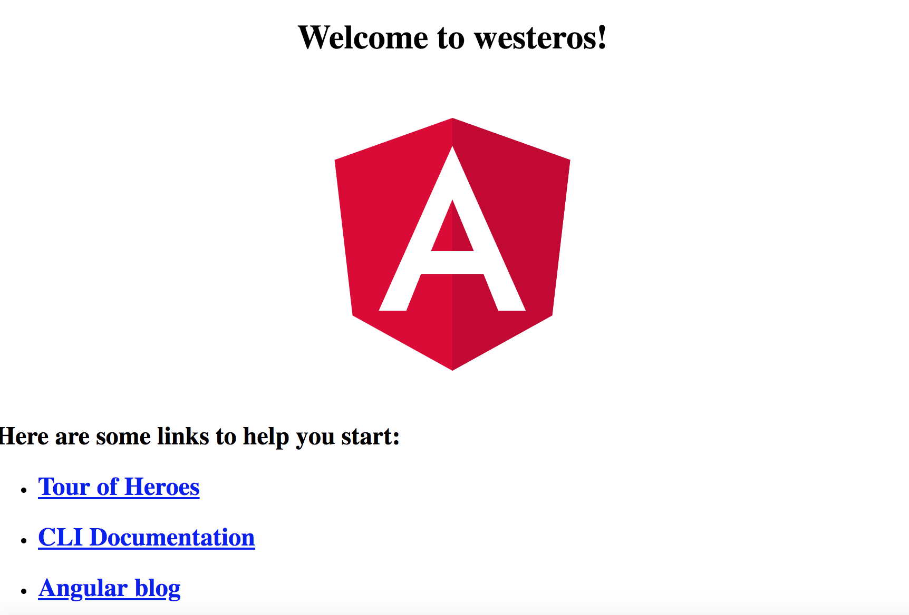

# Introduction to Angular and Angular 7+

There's nothing special about Angular that requires us to use nvm. However, we start this lesson by talking about nvm because it's just good to have. Also, some of the projects we may be using later in this class may use older versions of node and for those we may need to use nvm.

1. get [nvm](https://github.com/creationix/nvm) to manage different node versions

2. use the most recent version of node possible

3. Install the [Angular cli] (https://cli.angular.io/)


use *ng new* to create new app.  In the image below, we attempt to use the cli in an outdated version of node, then use nvm to switch to the version of node where we installed the angular cli:


Now that you're all set up with the Angular cli and nvm, we're ready to create a new Angular app.

The Angular cli is very similar to create_react_app

Use ng new to create a new Angular app:

```
  ng new your_app_name

```

when prompted , say "yes" to Angular router and choose SCSS as your css option.

Use
```
  ng serve

```
to run the application from inside of the project's root directory.

When you're up and running, you should see this image:



When everything is up and running, feel free to move on to [Unit 1](Unit01.md)
