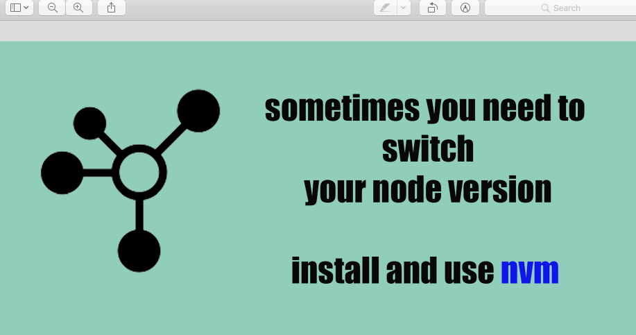

# Introduction to Angular and Angular 7+

1. get [nvm](https://github.com/creationix/nvm) to manage different node versions

2. use the most recent version of node possible

3. Install the [Angular cli] (https://cli.angular.io/)


use *ng new* to create new app.  In the image below, we attempt to use the cli in an outdated version of node, then use nvm to switch to the version of node where we installed the angular cli:





```
  ng new westeros

```
