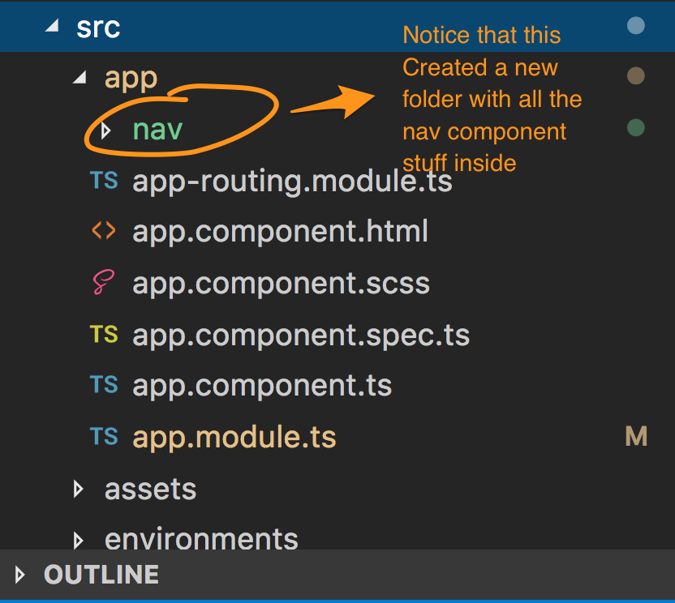

# Unit 01 :  Structure

### Where is everything?


Notice in the above diagram, we only have one component which is rendered when the app loads.

These 4 files are all associated with that one component:

```
app.component.html
app.component.scss
app.component.spec.ts
app.component.ts

```

### Using the scaffolder to create more components

Angular has a generator that will scaffold new components for us.
We will create three new pages.  Name them whatever you'd like.

I'm going to create a navigation component, and then 3 pages for 3 different regions of Westeros.

cd into the *app* folder, then

do either
```
ng generate component nav  
```
or
```
ng g c nav
```

(the second one is a shortcut)

now look at your folder structure:


