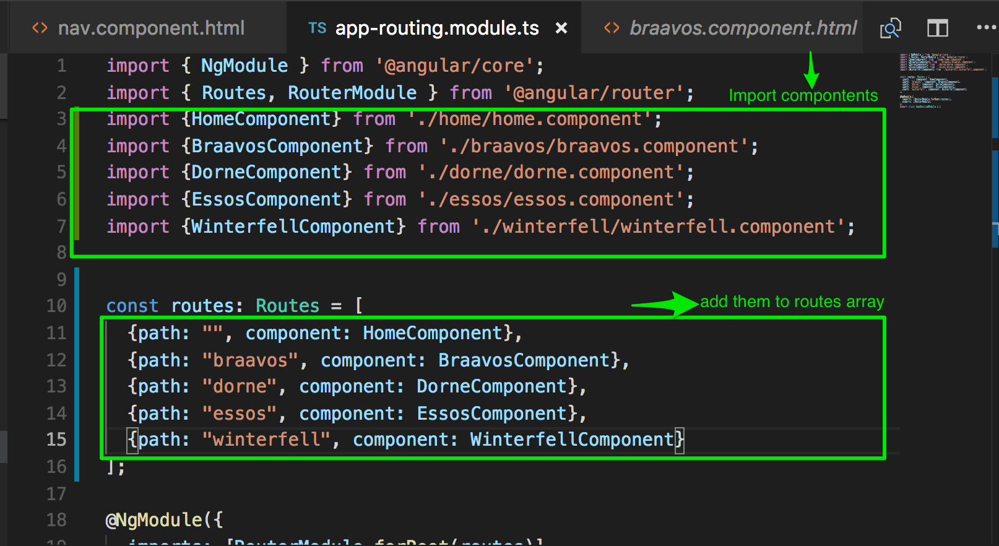

# Unit 03:  Routing

Since we said "yes" to routing when we first created the project with ng new , we should have a
*src/app/app-routing.module.ts* file.

Also, in our *src/app/app.component.html*  we should have a zone where the current route's page is displayed in our main app template. This zone is called the "router-outlet":

```
<router-outlet></router-outlet>
```

Here's how we hook everything up to get the router working:

-  In *src/app/app-routing.module.ts* ,



...... and .... it just works ! (make sure your html in nav looks like it should... see [Unit02](../Unit02/Unit02.md) ) for reference.


